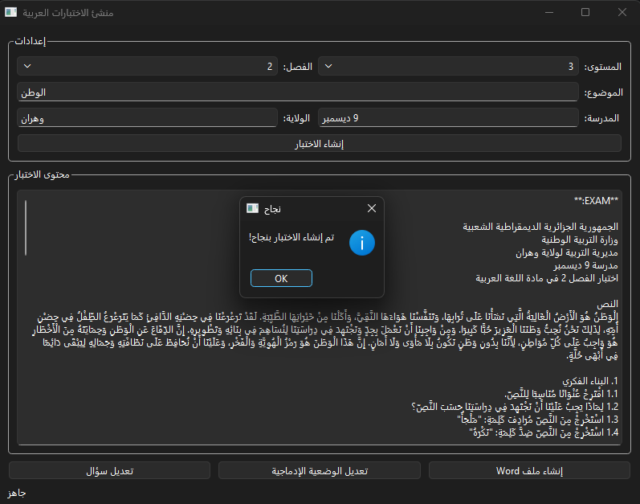
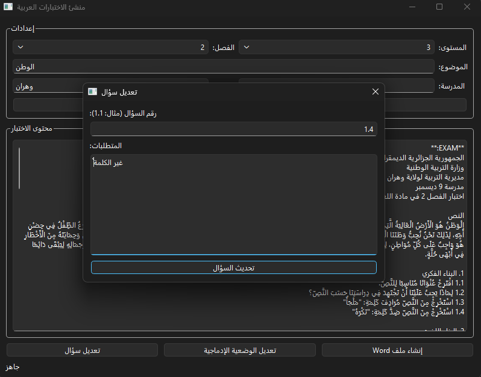

# Arabic Exam Generator 🎓

An AI-powered tool to generate Arabic language exams with customizable content, themes, and difficulty levels. Built with Google Gemini API and featuring both CLI and GUI interfaces.

## Features ✨

- **AI-Powered Exam Generation** – Creates original Arabic exams using Google Gemini 3.5 Flash
- **Multi-Grade Support** – Tailored content for grades 2, 3, 4, and 5 (الصف الثاني إلى الخامس الابتدائي)
- **Customizable** – Set school name, location, theme, and semester
- **Few-Shot Learning** – Uses two example exams per grade/semester as templates for consistent structure
- **Interactive Editing** – Regenerate specific questions or the integration scenario on demand
- **Word Document Export** – Generate properly formatted .docx files with Arabic RTL support
- **Dual Interface** – Terminal chatbot or modern GUI (PySide6)
- **Environment-Safe** – No hardcoded secrets; uses environment variables for API key

## Prerequisites

- Python 3.11+
- Conda or virtual environment manager
- Google Gemini API key (free tier available at [Google AI Studio](https://aistudio.google.com/app/apikey))
- Exam example images in PNG/JPG format (you provide these)

## Setup

### 1. Clone the Repository

```bash
git clone https://github.com/abdouRE/arabic-exam-generator.git
cd arabic-exam-generator
```

### 2. Create Conda Environment

```bash
conda env create -f environment.yml
conda activate testbuilder
```

### 3. Add Your Gemini API Key

Create a local `.env` file in the project root and add your key:

```env
GEMINI_API_KEY=your_actual_api_key_here
```

The app reads `.env` automatically at startup, and the file is ignored by git.

### 4. Create Exam Folder Structure

```
EXAMS/
├── 2ap-1-exam1/
├── 2ap-1-exam2/
├── 2ap-2-exam1/
├── 2ap-2-exam2/
├── 2ap-3-exam1/
├── 2ap-3-exam2/
├── 3ap-1-exam1/
├── 3ap-1-exam2/
├── 3ap-2-exam1/
├── 3ap-2-exam2/
├── 3ap-3-exam1/
├── 3ap-3-exam2/
├── 4ap-1-exam1/
├── 4ap-1-exam2/
├── 4ap-2-exam1/
├── 4ap-2-exam2/
├── 4ap-3-exam1/
├── 4ap-3-exam2/
├── 5ap-1-exam1/
├── 5ap-1-exam2/
├── 5ap-2-exam1/
├── 5ap-2-exam2/
├── 5ap-3-exam1/
└── 5ap-3-exam2/
```

### 5. Add Example Exam Images

Place your own exam PDF screenshots (PNG/JPG) inside each folder. The AI uses **two example exams per grade/semester** as few-shot references:

```
EXAMS/2ap-1-exam1/exam1.png
EXAMS/2ap-1-exam2/exam1.png
EXAMS/3ap-1-exam1/exam1.png
EXAMS/3ap-1-exam2/exam1.png
# ... etc
```

You can place multiple image files per folder if your example exam spans several pages.

## Usage

### Option 1: GUI (Recommended)

```bash
conda activate testbuilder
python gui.py
```

1. Select grade and semester
2. Enter exam theme (e.g., "الحيوانات", "البيئة")
3. Enter school name and town
4. Click **إنشاء الاختبار** (Create Exam)
5. Review the generated exam
6. Edit questions if needed
7. Export to Word document

### Option 2: Terminal

```bash
conda activate testbuilder
python test.py
```

Follow the interactive prompts to generate and customize your exam.

If you prefer not to activate the environment manually each time:

```bash
conda run -n testbuilder python gui.py
```

Note: `conda run -n testbuilder python test.py` will not work reliably for the interactive terminal chatbot because it needs a real terminal stdin for `input()`.

## Example Exam Output

Generated exams include:

- **Header** – School name, location, date, subject
- **Reading Passage** (النص) – Theme-based text
- **البناء الفكري** – Comprehension & vocabulary questions
- **البناء اللغوي** – Grammar & linguistic analysis
- **الوضعية الادماجية** – Integration/writing scenario
- **Correction Sheet** – Model answers for all questions

### Generated Word Document

The application generates a professional Word document (`arabic_exam.docx`) with proper Arabic RTL formatting, saved to your working directory.

> 📝 The sample below has been converted to PDF for in-browser preview. The actual output is a fully editable `.docx` file.

[📄 View sample output (PDF)](sample_output/arabic_exam.pdf)

## Screenshots

### Success Message – Exam Generated

The GUI shows a success notification when an exam is generated:

<p align="center">
  
</p>

### Editing Questions

You can interactively edit specific questions using the UI:

<p align="center">
  
</p>

## Project Structure

```
arabic-exam-generator/
├── environment.yml                  # Conda environment & dependencies
├── gui.py                           # PySide6 GUI interface
├── test.py                          # Core exam generation logic / CLI chatbot
├── README.md                        # This file
├── .gitignore                       # Git ignore rules
├── EXAMS/                           # Example exam folders provided by the user
│   ├── 2ap-1-exam1/
│   ├── 2ap-1-exam2/
│   ├── 2ap-2-exam1/
│   ├── ...
│   └── 5ap-3-exam2/
├── sample_output/                   # Sample generated output files
│   ├── arabic_exam.docx
│   └── arabic_exam.pdf
└── screenshots/                     # GUI screenshots and example images
  ├── edit_question.png
  └── succes_generation.png
```

## How It Works

1. **Load Examples** – Reads two sets of exam images from the `EXAMS/` folders (exam1 and exam2) per grade/semester
2. **AI Generation** – Sends both examples to Gemini as few-shot context along with your theme and grade requirements
3. **Parse Output** – Extracts sections (البناء الفكري, البناء اللغوي, الوضعية الادماجية)
4. **Interactive Editing** – Regenerate specific questions or scenarios on demand
5. **Export** – Generate properly formatted Word documents with RTL Arabic support

## Supported Grades

| Grade | Arabic | Semesters |
|-------|--------|-----------|
| Grade 2 | الصف الثاني الابتدائي | 1, 2, 3 |
| Grade 3 | الصف الثالث الابتدائي | 1, 2, 3 |
| Grade 4 | الصف الرابع الابتدائي | 1, 2, 3 |
| Grade 5 | الصف الخامس الابتدائي | 1, 2, 3 |

## Requirements

- python 3.11
- pillow (image processing)
- python-docx (Word document generation)
- pyside6 (GUI framework)
- google-genai (Gemini API client)

See `environment.yml` for the full dependency list.

---

## Tips & Troubleshooting

- **Better output quality** – The more representative your example exam images are, the more the AI will match the exact style, layout, and difficulty of your real exams. Use clear, high-resolution screenshots.
- **Missing folder error** – Make sure every `EXAMS/Xap-Y-examZ/` folder exists and contains at least one image before running. The app will warn you if a folder is empty or missing.
- **API key not found** – Make sure your `.env` file is in the project root (same folder 
as `test.py`) and that the variable is named either `GEMINI_API_KEY` or `GOOGLE_API_KEY` 
— the app accepts both.
- **Arabic text not rendering correctly in Word** – If numbers appear on the wrong side or text runs 
left-to-right, select all text (`Ctrl + A`), then in the **Home** tab set paragraph direction 
to **Right-to-Left** and alignment to **Align Right** (`Ctrl + R`).
- **Editing questions** – Question IDs follow the format `1.x` for البناء الفكري and `2.x` for البناء اللغوي (e.g., `1.2`, `2.3`).
